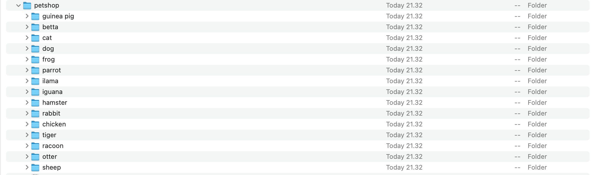

# soal-shift-sisop-modul-2-B09-2021

* Vincent Yonathan    - 05111940000186
* Aprilia Annisa      - 05111940000199
* Pramudityo Prabowo  - 05111940000210
---

### Soal Modul 2
[Soal Shift Modul 2](https://docs.google.com/document/d/121ZqwL7KXiKy3YpQgP6INuYlb4969WOj1GlZ9umO65w/edit)

---

### Daftar isi
* [Soal 1](#soal-1)
* [Soal 2](#soal-2)
* [Soal 3](#soal-3)

---
### Soal 1
*Praktikan* diminta untuk membantu Steven untuk menyiapkan hadiah untuk ulang tahun Stevany dengan mendownload foto, film dan musik lalu dimasukkan kedalam zip dengan urutan dan waktu yang ditentukan.

#### 1.a)
*Praktikan* diminta untuk membuat folder dengan nama Musyik untuk mp3, Fylm untuk mp4, dan Pyoto untuk jpg.

#### Source Code :
```c
void do_makedir_foto(void) {
    pid_t pid = fork();
    if (pid == 0){
        char *argv[16];
        argv[0] = "mkdir";
        argv[1] = "-p";
        argv[2] = "Pyoto";
        argv[3] = NULL;
        execv("/bin/mkdir", argv);
    }
    else {
        int status;
        waitpid(pid, &status, 0);
    }
}
void do_makedir_musik(void) {
    pid_t pid = fork();
    if (pid == 0){
        char *argv[16];
        argv[0] = "mkdir";
        argv[1] = "-p";
        argv[2] = "Musyik";
        argv[3] = NULL;
        execv("/bin/mkdir", argv);
    }
    else {
        int status;
        waitpid(pid, &status, 0);
    }
}
void do_makedir_film(void) {
    pid_t pid = fork();
    if (pid == 0){
        char *argv[16];
        argv[0] = "mkdir";
        argv[1] = "-p";
        argv[2] = "Fylm";
        argv[3] = NULL;
        execv("/bin/mkdir", argv);
    }
    else {
        int status;
        waitpid(pid, &status, 0);
    }
}
```
Program akan menggunakan proses `fork`, `exec`, dan `wait`, untuk menjalankan proses yang akan melakukan `mkdir` untuk membuat sebuah folder, `-p` untuk membuat parent directory jika dibutuhkan, lalu diisi dengan nama folder seperti `Fylm`, `Pyoto`, dan `Myusik` sesuai dengan kebutuhan, lalu ditutup dengan `NULL`.
#### Output :


#### 1. b)
*Pratikan* diminta untuk mendownload foto, film, dan musik dari link yang sudah disediakan

#### Source Code :
```c
void do_download_foto(void) {
    pid_t pid = fork();
    if (pid == 0){
        char *wget_argv[16];
        wget_argv[0] = "wget";
        wget_argv[1] = "--no-check-certificate";
        wget_argv[2] = "-O";
        wget_argv[3] = "Foto_for_Stevany.zip";
        wget_argv[4] = "https://drive.google.com/uc?id=1FsrAzb9B5ixooGUs0dGiBr-rC7TS9wTD&export=download";
        wget_argv[5] = NULL;
        execv("/bin/wget", wget_argv);
    }
    else {
        int status;
        waitpid(pid, &status, 0);
    }
}
void do_download_musik(void) {
    pid_t pid = fork();
    if (pid == 0){
        char *wget_argv[16];
        wget_argv[0] = "wget";
        wget_argv[1] = "--no-check-certificate";
        wget_argv[2] = "-O";
        wget_argv[3] = "Musik_for_Stevany.zip";
        wget_argv[4] = "https://drive.google.com/uc?id=1ZG8nRBRPquhYXq_sISdsVcXx5VdEgi-J&export=download";
        wget_argv[5] = NULL;
        execv("/bin/wget", wget_argv);
    }
    else {
        int status;
        waitpid(pid, &status, 0);
    }
}
void do_download_film(void) {
    pid_t pid = fork();
    if (pid == 0){
        char *wget_argv[16];
        wget_argv[0] = "wget";
        wget_argv[1] = "--no-check-certificate";
        wget_argv[2] = "-O";
        wget_argv[3] = "Film_for_Stevany.zip";
        wget_argv[4] = "https://drive.google.com/uc?id=1ktjGgDkL0nNpY-vT7rT7O6ZI47Ke9xcp&export=download";
        wget_argv[5] = NULL;
        execv("/bin/wget", wget_argv);
    }
    else {
        int status;
        waitpid(pid, &status, 0);
    }
}
```
Program akan menggunakan proses `fork`, `exec`, dan `wait`, untuk menjalankan proses yang akan melakukan `wget`. disini `wget` akan mendownload melalui link link yang sudah disediakan setelah melakukukan `--no-check-certificate` untuk menskip pengecekan server certificate, `-o` untuk merubah output dari zip menjadi nama yang ditentukan seperti `Film_for_Stevany.zip`, `Foto_for_Stevany.zip`, dan `Musik_for_Stevany.zip`.

#### Output :


#### 1. c)
*Praktikan* diminta untuk mengextract file yang telah di download

#### Source Code :
```c
void do_unzip_foto(void){
    pid_t pid = fork();
    if (pid == 0){
    char *argv[16];
    argv[0]= "unzip";
    argv[1]= "-qq";
    argv[2]= "Foto_for_Stevany.zip";
    argv[3]= NULL;
    execv("/bin/unzip", argv);
    }
    else {
        int status;
        waitpid(pid, &status, 0);
    }
}
void do_unzip_musik(void){
    pid_t pid = fork();
    if (pid == 0){
    char *argv[16];
    argv[0]= "unzip";
    argv[1]= "-qq";
    argv[2]= "Musik_for_Stevany.zip";
    argv[3]= NULL;
    execv("/bin/unzip", argv);
    }
    else {
        int status;
        waitpid(pid, &status, 0);
    }
}
void do_unzip_film(void){
    pid_t pid = fork();
    if (pid == 0){
    char *argv[16];
    argv[0]= "unzip";
    argv[1]= "-qq";
    argv[2]= "Film_for_Stevany.zip";
    argv[3]= NULL;
    execv("/bin/unzip", argv);
    }
    else {
        int status;
        waitpid(pid, &status, 0);
    }
}
```
Program akan menggunakan proses `fork`, `exec`, dan `wait`, untuk menjalankan proses yang akan melakukan `unzip`. `-q` digunakan untuk menekan pesan yang masuk kedalam terminal lalu file akan diberi nama sesuai dengan format yaitu `Film_for_Stevany.zip`, `Foto_for_Stevany.zip`, dan `Musik_for_Stevany.zip`.

#### Output :


#### 1. d)
*Praktikan* diminta untuk memasukkan file yang telah diextract ke dalam folder yang bersesuaian.

#### Source Code :
```c
void do_move_foto(void){
    pid_t pid = fork();
    if (pid == 0){
    char *argv[16];
    argv[0]= "mv";
    argv[1]= "-v";
    argv[2]= "FOTO";
    argv[3]= "Pyoto";
    argv[5]= NULL;
    execv("/bin/mv", argv);
    }
    else {
        int status;
        waitpid(pid, &status, 0);
    }
}
void do_move_musik(void){
    pid_t pid = fork();
    if (pid == 0){
    char *argv[16];
    argv[0]= "mv";
    argv[1]= "-v";
    argv[2]= "MUSIK";
    argv[3]= "Musyik";
    argv[5]= NULL;
    execv("/bin/mv", argv);
    }
    else {
        int status;
        waitpid(pid, &status, 0);
    }
}
void do_move_film(void){
    pid_t pid = fork();
    if (pid == 0){
    char *argv[16];
    argv[0]= "mv";
    argv[1]= "-v";
    argv[2]= "FILM";
    argv[3]= "Fylm";
    argv[4]= NULL;
    execv("/bin/mv", argv);
    }
    else {
        int status;
        waitpid(pid, &status, 0);
    }
}
```
Program akan menggunakan proses `fork`, `exec`, dan `wait`, untuk menjalankan proses yang akan melakukan `mv`. `-v` hanya berfungsi sebagai bentuk info bahwa file sedang dipindahkan. lalu tempat dan tujuan dari pemindahan ditetapkan.

#### Output :


#### 1. e)
*Praktikan* diminta untuk membuat program berjalan pada waktu yang diminta.
```c
void Daemon(){
    pid_t pid;
    int status;
    const unsigned sleep_time = 1;
    const int b_month = 3;
    const int b_day = 9;
    const int b_hour = 22;
    const int b_min = 22;
    while(1)
    {
        time_t now = time(NULL);
        struct tm *timenow=localtime(&now);
        if (b_month == timenow->tm_mon && b_day == timenow->tm_mday && b_hour == timenow->tm_hour&&b_min==timenow->tm_min&& timenow->tm_sec==0)
        its_birthday(pid,status);
        else if (b_month == timenow->tm_mon && b_day == timenow->tm_mday && b_hour-6 == timenow->tm_hour&&b_min==timenow->tm_min&& timenow->tm_sec==0)
        h_6_birthday(pid);
        while(wait(&status)>0);
        sleep(sleep_time);
    }
}
```


### Soal 2
*Praktikan* diminta membantu loba yang bekerja di sebuah "petshop" terkenal, dia mendapatkan *zip* yang berisikan banyak sekali foto peliharaan dan ia diperintahkan untuk mengkategorikan foto-foto peliharaan tersebut dan mencatat daftar **nama** dan **umur** hewan sesuai dengan kategorinya di file *"keterangan.txt"*.

#### 2. a)
*Praktikan* diminta untuk mengextract *zip* ke dalam folder "/Users/macbook/soal2/petshop" dan dapat membedakan folder dan file yang harus dikerjakan serta menghapus folder-folder yang tidak dibutuhkan.

#### Source Code :
```c
...
void unzip_file()
{
    pid_t child_id;
    int status;
    child_id = fork();

    if (child_id < 0)
    {
        exit(EXIT_FAILURE);
    }

    if(child_id == 0)
    {
        //goal
        char *New_Folder[] = {"mkdir","-p", "/Users/macbook/soal2/petshop", NULL};
        executedprogram("/bin/mkdir", New_Folder);

        //source
        char *Unzip_file[] = {"unzip", "-q", "/Users/macbook/soal2/pets.zip", "-d", "/Users/macbook/soal2/petshop", "*.jpg", NULL};
        executedprogram("/usr/bin/unzip", Unzip_file);
    }

    else { while ((wait(&status)) > 0);}
}
```


Pengerjaan program di atas menggunakan proses `fork` x `exec` x `wait` yang dapat menjalankan dua proses dalam suatu program. Dimana pada program di atas membuat suatu folder baru yang bernama *Petshop* dan dibuat di direktori "/Users/macbook/soal2/". Kemudian dibuat sebuah program untuk men-unzip file yang berada di direktori "/Users/macbook/soal2/pets.zip" yang berisikan file-file penting yang akan dimasukkan ke dalam folder baru *petshop* yang telah dibuat dengan menggunakan `-d`, dengan syarat dimana file yang dimasukkan hanya berjenis **.jpg** saja. Lalu setiap program akan dijalankan menggunakan *executedprogram* yang berisikan proses `execv`.

#### Output :


#### 2. b)
*Praktikan* diminta mengkategorikan semua jenis peliharaan, kemudian membuat folder-folder untuk setiap jenis dari peliharaan yang ada didalam *zip*.

Sebelum melakukan pengecekan pada setiap nama file yang ada didalam folder *Petshop* akan di cut **.jpg** guna untuk memudahkan program dalam pencarian atribut-atribut yang ada dinama file.
#### Source Code :
```c
char* cut_jpg (char*s)
{
    int a,b;
    char* new;

    for (b = 0; s[b] != '\0'; b++);

    // panjang dari string
    a = b - 4 + 1;

    if (a < 1)return NULL;

    new = (char*) malloc (a * sizeof(char));

    for (b = 0; b < a - 1; b++)new[b] = s[b]; new[b] = '\0'; return new;
}
```

Selanjutnya program akan mengecek dan menyimpan setiap urutan string yang ada di nama file-file tersebut :
#### Source Code :
```c
    if(strcmp(dp->d_name, ".") != 0 && strcmp(dp->d_name, "..") != 0)
                {
                    char *sign1, *sign2, *sign3, *sign4;
                    char *namefile = dp -> d_name; char *namefilenew = cut_jpg(namefile);

                    char hasil1[100], hasil2[100]; 
                    char path2[100], path3[100];
                    char cat[50], name[50], umur[50];
   
               for(sign1 = strtok_r(namefilenew, "_", &sign3); sign1!=NULL; sign1=strtok_r(NULL, "_", &sign3))
                    {
                        int x = 0;
                        char path[100]="/Users/macbook/soal2/petshop/"; 
                        char tekspath[100], fileket[100], namahewan[100];

                        strcpy(hasil1, namefile); strcpy(hasil2, namefile);
                        strcpy(path2, path); strcpy(path3, path);
                        
                        for(sign2 = strtok_r(sign1, ";", &sign4); sign2 != NULL; sign2 = strtok_r(NULL, ";", &sign4))
                        {
                            //nyimpen sesuai dengan atribut
                            if(x==0){
                                strcpy(cat, sign2);
                            }
                            if(x==1){
                                strcpy(name, sign2);
                            }
                            if(x==2){
                                strcpy(umur, sign2);
                            }
                            x = x + 1;
                        }
```
Pengerjaan pada program di atas menggunakan `strtok_r` dimana berfungsi untuk membaca tanda di dalam string yang terdapat di dalam nama-nama file yang ada di folder *Petshop*, tanda yang akan diketahui dan dibaca oleh program adalah `;` dan `_` (*underscore*). Lalu penginisialisasian variabel-variabel yang akan digunakan dalam proses pencarian. Kemudian program akan melakukan *looping* untuk mengecek setiap file dimana :
- Jika string di urutan ke 0 atau `if(x==0)` maka atribut tersebut akan disimpan kedalam variabel array **cat** atau categories.
- Jika string di urutan ke 1 atau `if(x==1)` maka atribut tersebut akan disimpan kedalam variabel array **name**.
- Jika string di urutan ke 2 atau `if(x==2)` maka atribut tersebut akan disimpan ke dalam variabel array **umur**.
- `x = x + 1` program akan melakukan **looping** untuk pengecekan.

Proses selanjutnya adalah pembuatan program berdasarkan kategori hewan:
#### Source Code :
```c
                        //nomer 2b
                        strcat(path, cat);
                        char *New_Folder[] = {"mkdir", "-p", path, NULL};
                        executedprogram("/bin/mkdir", New_Folder);
```
Pengerjaan pada program di atas adalah penggunaan `strcat` yang guna untuk menyisipkan dari belakang variabel array **cat** berisikan jenis-jenis hewan kedalam path yaitu "/Users/macbook/soal2/". Lalu program akan membuat suatu folder jenis hewan, `-p` digunakan agar ketika suatu pengecekan jenis hewan terdapat beberapa jenis hewan yang sama maka hanya akan diambil satu kali saja dan program akan dieksekusi menggunakan *executedprogram*.

#### Output :


#### 2. c) & d)
*Praktikan* diminta untuk memindahkan foto kedalam folder yang sesuai dengan kategori jenisnya dan direname dengan nama peliharaan. Lalu jika terdapat lebih dari satu jenis hewan maka dimasukkan juga kedalam folder setiap kategorinya.

#### Source Code :
```c
                        //copy nama hewan biar ga ketambahan .jpg
                        strcpy(namahewan, name);
                        
                        //nomer 2c dan 2d
                        strcat(name, ".jpg");
                        strcat(path2, hasil2);
                        char *copyfolder[] = {"cp", path2, path, NULL};
                        executedprogram("/bin/cp", copyfolder);

                        //rename nama file
                        strcpy(tekspath, path);
                        strcpy(path3, path);strcat(path3, "/");
                        strcat(path3, hasil2);strcat(path, "/");
                        strcat(path, name);

                        char *renamefile[] = {"renamefile", path3, path, NULL};
                        executedprogram("/bin/mv", renamefile);
```

- Pengerjaan pada program diatas  yaitu menyimpan suatu nama pada variabel array baru yaitu **namahewan** untuk menyimpan nama dari hewan sebelum penambahan **.jpg** yang akan digunakan ketika di nomor 2e. 
- Pengerjaan selanjutnya adalah menyisipkan string dari belakang dengan penambahan **.jpg**.
- Lalu penyisipan pada path "/Users/macbook/soal2/petshop/[categories]/". 
- Kemudian program akan copy file ke dalam path yaitu "/Users/macbook/soal2/petshop/" dan dieksekusi menggunakan *executedprogram*.
- Lalu copy path ke dalam variabel tekspath yang akan digunakan pada nomor 2e.
- Setelah program berhasil mencopy file-file hewan kedalam folder jenis masing-masing, kemudian program akan merubah nama file sesuai dengan nama hewannya tersebut.

#### Output :


#### 2. e)
*Praktikan* diminta untuk membuat sebuah folder *"Keterangan.txt"* yang berisikan **nama** dan **umur** disetiap folder yang sesuai dengan kategorinya.

#### Source Code :
```c
                        strcat(tekspath, "/keterangan.txt"); 
                        strcpy(fileket, "nama : ");strcat(fileket, namahewan);
                        strcat(fileket, "\numur : ");strcat(fileket, umur);strcat(fileket, " tahun\n\n");

                        FILE *keterangan = fopen(tekspath, "a"); fputs(fileket, keterangan);
                        fclose(keterangan);  
```

Pengerjaan pada proses diatas adalah penyisipan *"/keterangan.txt"* kedalam variabel tekspath yang berisi dengan direktori path, lalu memasukkan keterangan nama dan umur di dalam file *keterangan.txt*. Setelah itu membuat sebuah FILE pointer keterangan menggunakan `fopen` untuk mengakses file-file yang ada di dalam tekspath dan kemudian dimasukkan kedalam variabel fileket, jika telah selesai pengeaksesan, penggunaan `fclose` maka pengaksesan file di setiap folder akan dihentikan.

#### Output :
- pertama


- kedua


#### Kendala yang dialami :
- Jika terjadi kesalahan dalam penempatan fork maka hasil compile program akan mengalami infinite loop.
- Awal mula kebingungan untuk menggunakan *fopen*.

---
### Soal 3
*Praktikan* diminta membantu Ranora dalam membuat tugas magangnya di “FakeKos Corp.” yang bekerja dalam keamanan data. Ranora ditugaskan untuk membuat program untuk tugas pertamanya.

#### 3. a)
*Praktikan* diminta membuat program C yang membuat direktori dengan nama sesuai timestamp [YYYY-mm-dd_HH:ii:ss] setiap 40 detik.

#### Source Code :
```c
...
int main(int argc, char *argv[]) 
{
  while (1) 
  {
    //3a
    pid_t pid2;
    int status,status2,status3,stats;
    pid2 = fork();
    char timenow[50];
    time_t times = time(NULL);
    struct tm* temporary = localtime(&times);
    strftime(timenow, 50, "%Y-%m-%d_%H:%M:%S", temporary);
     if (pid2 == 0) 
     {
        char *argv[] = {"mkdir", timenow, NULL};
        execv ("/usr/bin/mkdir", argv);
     }
     ...
     sleep(40);
  }
}
```
- Pengerjaan dilakukan menggunakan `Daemon` yang ditandai dengan while(1).
- Mendeklarasikan `pid2` (parent id) bertipe data `pid_t` untuk melakukan fork
- Pada source code berikut juga didefinisikan status untuk membuat program menunggu sebuah proses yang didefinisikan pada kode sebelumnya
- Kemudian, Program akan menjalankan fork dan menyimpannya ke pid2
- Selanjutnya adalah mendefinisikan array `timenow` bertipe data char dengan alokasi besar arranya 50.
- Setelah itu mendefinisikan variable `times` bertipe data `time_t` dan melakukan *assign* `time(NULL)` yang didapatkan dari `#include <time.h>` yang akan mengoutputkan waktu pada saat itu
- Menggunakan `struct tm*` dan mendefinisikan variable `temporary` yang akan menyimpan `localtime(&times)` yang mengubah variable yang berisi waktu sekarang menjadi waktu lokal.
- Berikutnya, menggunakan `strftime` yang *mengassign* variable `timenow` dengan value dari variable `temporary` dengan format yang diminta yaitu `"%Y-%m-%d_%H:%M:%S"`
- Kemudian menggunakan kondisi `if (pid2 == 0) ` yang menjadi kondisi untuk menjalankan child process telah berhasil dan dapat menjalankan proses berikutnya
- Lalu kita mendefinisikan `*argv[]` dengan tipe data char yang berisi arguments yang akan digunakan dalam `execv` yaitu disini adalah `{"mkdir", timenow, NULL}`
- Pada akhirnya, menggunakan `execv` untuk menjalankan program untuk membuat (`directory`) dengan menggunakan directory dari `mkdir` dengan argumen `"/usr/bin/mkdir"` dan sesuai dengan isi dari variable `timenow` 
- Lalu `execv` harus diakhiri dengan `NULL` dan program dapat dijalankan. Karena diminta untuk membuat setiap 40 detik, maka menggunakan `sleep(40)` pada akhir while.

#### Output :


#### 3. b)
*Praktikan* diminta mengisi 10 foto dari https://picsum.photos/ pada folder/direktori setelah setiap direktori pada nomor 3.a) selesai. Setiap gambar tersebut akan didownload dengan selang waktu 5 detik dan akan diberi nama dengan format timestamp [YYYY-mm-dd_HH:ii:ss] dan gambar tersebut berbentuk persegi dengan ukuran (n%1000) + 50 pixel dimana n adalah detik Epoch Unix.

#### Source Code :
```c
...
  pid_t temp;
     while ((wait(&stats)) > 0);
     temp = fork();
     if(temp == 0)
     {
       pid_t pid5;
       while ((wait(&status)) > 0); //agar menunggu folder jadi terlebuh dahulu
       chdir(timenow);
     	//3b
     	  int i;
        for (i = 1 ; i < 11 ; i ++, sleep(5)) 
        {
          pid5 = fork();
          if (pid5 == 0)
          {
            char timenow2[50];
            time_t epoch = time(NULL);
            struct tm* temp = localtime(&epoch);
            strftime(timenow2, 50, "%Y-%m-%d_%H:%M:%S", temp);
            long long size = ((long long)epoch % 1000)+50;
            char sizelink[100] = "https://picsum.photos/";
            char ukuran[10];
            sprintf(ukuran, "%lld", size);
            strcat(sizelink, ukuran);

            char dir[100];
            strcpy(dir , timenow2);

            char *arguments[] = {"wget", "-q", "-O", dir, sizelink ,NULL};
            execv("/usr/bin/wget", arguments);
          }
        }
 ...
```
Tahap Inisialisasi :
- Pada soal 3 b.) ini, pertama dideklarasikan dahulu `pid_t` dengan nama `temp` yang akan menjadi kondisi untuk program dijalankan. 
- Kemudian memakai ```c while ((wait(&stats)) > 0);``` dimana ini digunakan agar program ini dijalankan menunggu proses sebelumnya selesai terlebih dahulu.
- Setelah itu melakukan `fork()` yang disimpan ke `temp` seperti proses pada umumnya 

Tahap Soal :
- `fork` digunakan sebagai kondisi dalam menjalankan code dan ketika telah dipenuhi maka code akan dijalankan.
- Mendeklarasikan lagi `pid_t` dengan nama disini `pid5` .
- Kemudian memakai ```c while ((wait(&status)) > 0);``` dimana ini digunakan agar program ini dijalankan menunggu proses sebelumnya selesai terlebih dahulu.
- Selanjutnya, karena gambar akan di*download* dalam folder yang telah dibuat dalam 3 a.) maka harus menggunakan `chdir(timenow);` dimana `timenow` merupakan variable yang menyimpan nama dari folder yang dibuat dengan format yang diminta.
- Karena pada soal diminta mendownload 10 foto, maka melakukan deklarasi variable looping `i` dan kemudian menggunakan forloop sebanyak 10 kali.
- Pada forloop tersebut, dilakukan `fork()` menggunakan `pid5=fork();` sebagai kondisionalnya dengan `if(pid5 == 0)`,
- Jika kondisional tersebut terpenuhi, barulah melakukan coding untuk permintaan soal
- Sama seperti nomor 3 a.) yaitu adalah mendefinisikan array `timenow2` bertipe data char dengan alokasi besar arranya 50.
- Setelah itu mendefinisikan variable `epoch` bertipe data `time_t` dan melakukan *assign* `time(NULL)` yang didapatkan dari `#include <time.h>` yang akan mengoutputkan waktu pada saat itu
- Menggunakan `struct tm*` dan mendefinisikan variable `temp` yang akan menyimpan `localtime(&times)` yang mengubah variable yang berisi waktu sekarang menjadi waktu lokal.
- Berikutnya, menggunakan `strftime` yang *mengassign* variable `timenow2` dengan value dari variable `temp` dengan format yang diminta yaitu `"%Y-%m-%d_%H:%M:%S"`.
- Langkah berikutnya adalah mendeklarasikan variable `size` bertipe data `long long` untuk menyimpan ukuran yang diminta dari foto yaitu `((long long)epoch % 1000)+50`.
- Kemudian juga mendeklarasikan variable array `sizelink` bertipe data `char` dan berukuran 100 yang didalamnya di*assign* link dari foto yang akan diunduh yaitu "https://picsum.photos/"
- Kemudian mendeklarasikan juga variable array `ukuran` dengan tipe data `char` dengan ukuran 10 untuk menampung hasil dari `size` yang merupakan langkah selanjutnya dari code yaitu ` sprintf(ukuran, "%lld", size);`
- Setelah itu karena link fotonya ternyata dapat diset ukurannya dengan cara menambahkan argumen dibelakang `/`, maka kita melakukan `strcat(sizelink, ukuran);` agar link nya tepat untuk mengunduh foto sesuai ukuran yang diinginkan.
- Kemudian terakhir mendeklarasikan variable array `dir` bertipe data `char` berukuran 100 dan nantinya akan diisi nama directory `timenow2` untuk nanti `wget` mengetahui harus masuk ke directory mana terlebih dahulu
- Langkah setelahnya, mendefinisikan `*arguments[]` dengan tipe data `char` yang berisi arguments yang akan digunakan dalam `execv` yaitu disini adalah `{"wget", "-q", "-O", dir, sizelink ,NULL}`
- Langkah terakhir adalah menggunakan `execv` untuk menjalankan program untuk melakukan download (`wget -q -O`) dengan menggunakan directory dari `dir` dari link pada `sizelink` dan ditambahkan argumen `"/usr/bin/wget"`. 

#### Output :


### 3. c)
Setelah direktori telah terisi dengan 10 gambar, program tersebut akan membuat sebuah file “status.txt”, dimana didalamnya berisi pesan “Download Success” yang terenkripsi dengan teknik Caesar Cipher dan dengan shift 5. Caesar Cipher adalah Teknik enkripsi sederhana yang dimana dapat melakukan enkripsi string sesuai dengan shift/key yang kita tentukan. Misal huruf “A” akan dienkripsi dengan shift 4 maka akan menjadi “E”. Karena Ranora orangnya perfeksionis dan rapi, dia ingin setelah file tersebut dibuat, direktori akan di zip dan direktori akan didelete, sehingga menyisakan hanya file zip saja.

#### Source Code :
Caesar Cipher :
Pada algoritma Caesar Cipher pada soal ini, diminta untuk menambahkan ASCII alphabet yang ada di kata "Download Success" sebanyak 5, karena itu algoritma pada program adalah :
```c
...
          pid_t pid3;
          while ((wait(&status2)) > 0); //agar menunggu folder jadi terlebuh dahulu
          char target[50];
          char encryp[50] = "Download Success";
          int sizet = strlen(encryp);
          int z;
          for(z=0 ; z<sizet; z++)
          {
            if(encryp[z] == ' ')
            {
              continue;
            }
            else if(encryp[z] >='a' && encryp[z] <= 'z')
            {
              encryp[z] += 5;
              if (encryp[z] > 'z')
              {
                encryp[z] = encryp[z] - 'z' + 'a' - 1;
              }
            }

            else if (encryp[z] >='A' && encryp[z] <= 'Z')
            {
              encryp[z] += 5;
              if (encryp[z] + 5 > 'Z')
              {
                if (encryp[z] > 'Z')
                {
                  encryp[z] = encryp[z] - 'Z' + 'A' - 1;
                }
              }
            }
            
          }
```
- Pertama, seperti biasanya akan dideklarasikan `pid_t` dengan nama `pid3` yang akan menjadi kondisi untuk program dijalankan. 
- Kemudian memakai ```c while ((wait(&stats2)) > 0);``` dimana ini digunakan agar program ini dijalankan menunggu proses sebelumnya selesai terlebih dahulu.
- Setelah itu, mendeklarasikan variable yang dibutuhkan yaitu `target` dan `encryp` yang berbentuk array dan bertipe data `char` dimana `encryp` akan diisikan oleh *statement* yang diminta oleh soal yaitu "Download Success". Kemudian juga dideklarasikan variable `sizet` bertipe data `int` untuk menyimpan panjang dari statement di `encryp` menggunakan fungsi `len(encryp)`.
- Setelah itu, algoritma Caesar Cipher ini menggunakan looping sehingga mendefinisikan variable looping `z` dan melakukan forloop sebanyak `sizet` atau panjang kalimat pada `encryp`.
- Setelah itu menjalankan berbagai kondisi yaitu apabila looping pada saat itu adalah *spasi* atau `encryp[z] == ' '`, maka program akan dilanjutkan. Algoritma setelahnya yaitu apabila `encryp[z]` ada dalam batas ASCII 'a' dan 'z', maka akan langsung ditambahkan dengan 5. Namun, apabila tidak maka akan dikembalikan ke batasan ASCII 'a' sampai 'z' menggunakan `encryp[z] = encryp[z] - 'z' + 'a' - 1;`.
- Begitupula dengan kondisi ketika `encryp[z]` ada dalam batas ASCII 'A' dan 'Z', maka akan langsung ditambahkan dengan 5. Namun, apabila tidak maka akan dikembalikan ke batasan ASCII 'A' sampai 'Z' menggunakan `encryp[z] = encryp[z] - 'Z' + 'A' - 1;`.

Tahap Soal (Txt dan Zipping) :

```c
 //3c
          pid3 = fork();
          chdir(".."); //balik ke direktori sebelumnya
          if (pid3 == 0 )
          {
            //for txt
            strcpy(target, timenow);
            strcat(target, "/");
            strcat(target, "status.txt"); //target/status.txt
            FILE* txt = fopen(target, "w");
            fputs(encryp, txt);
            fclose(txt);

            //for zip
            strcpy(target, timenow);
            strcat(target, ".zip");
            
            char *args[] = {"zip", "-r", target, timenow , NULL};
            execv("/usr/bin/zip", args);
          }
          pid_t pid4;
          while ((wait(&status3)) > 0); //agar menunggu folder jadi terlebuh dahulu
          //pid4 = fork();
          // if (pid4 == 0)
          // {
            char *arg[] = {"rm", "-r",timenow, NULL};
            execv("/usr/bin/rm", arg);
          // }
      }
  ....
```
txt :
- Pada tahap yang diminta oleh soal yaitu zipping, seperti biasanya akan melakukan `fork()` menggunakan `pid3` yang telah dideklarasikan pada tahap Caesar Cipher diatas.
- Kemudian menggunakan `chdir(..)` agar tidak terbuat dalam folder yang sama seperti pada gambar pada 3.b).
- Setelah itu, kembali menggunakan kondisional `if(pid3 == 0)`
- Didalam kondisional tersebut, dijalankan pertama adalah menggunakan `strcpy` untuk mengisi variable `target` dengan `timenow` yaitu format nama folder pada 3.a). Kemudian melakukan `strcat` agar menambahkan suatu kalimat di bagian belakang `target` yang terisi `timenow` sekarang sebagai direktorinya, yaitu "/" dengan syntax `strcat(target, "/");`
- Kemudian, agar penamaan sesuai "status.txt" maka direktori `target` tadi harus dilakukan `strcat` lagi untuk ditambahkan `status.txt`.
- Kemudian mendeklarasikan `FILE` dengan variable `txt` agar bisa diakses untuk  membuka `target` yaitu file yang dibuat dan `w` untuk write.
- Kemudian dilakukan `fputs` untuk mengisi file `txt` yang berbentuk .txt tersebut dengan `encryp` yang berisi statement "Download Success" yang telah terenkripsi.

zip :
- Untuk zip, tahap pertama yang dilakukan adalah dengan mengisi variable `target` dengan `timenow` dan menambahkan kalimat dibelakangnya menggunakan `strcat`. String tersebut berisi ".zip" sehingga `target` sekarang terisi dengan "(timenow).zip"
- Kemudian memendefinisikan `*args[]` dengan tipe data `char` yang berisi arguments yang akan digunakan dalam `execv` yaitu disini adalah `{"zip", "-r", target, timenow , NULL}`
- Langkah terakhir adalah menggunakan `execv` untuk menjalankan program untuk melakukan zip (`zip -r`) dengan argumen `"/usr/bin/zip"`. 

menghapus folder awal :
- Menggunakan ```c while ((wait(&stats)) > 0);``` dimana ini digunakan agar program ini dijalankan menunggu proses sebelumnya selesai terlebih dahulu yaitu pembentukan zip.
- Kemudian memendefinisikan `*arg[]` dengan tipe data `char` yang berisi arguments yang akan digunakan dalam `execv` yaitu disini adalah `{"rm", "-r",timenow, NULL}`.
- Langkah terakhir adalah menggunakan `execv` untuk menjalankan program untuk melakukan remove (`rm -r`) dengan argumen `"/usr/bin/rm"`. 

#### Output :


### 3. d)
*Praktikan* diminta membuat program tersebut akan men-generate sebuah program “Killer” yang executable, dimana program tersebut akan menterminasi semua proses program yang sedang berjalan dan akan menghapus dirinya sendiri setelah program dijalankan menggunakan program bash.

#### Source Code :
```c
 //3d --> bash Killer.sh
    char newdir[50] = "/home/prk/praktikum2/Killer.sh";
    FILE* killer = fopen(newdir, "w");
    fprintf(killer , "#!/bin/bash\nkillall ./soal3\n");
    fclose(killer);
```
- Nomor 3.d) ini akan sepaket dengan nomor 3.c) namun disini hanya akan diambil potongan kodenya
- Pertama akan dideklarasikan variable array `newdir` bertipe data `char` berukuran 50 yang diisi dengan directory dimana akan dibuat program killer ini yaitu `"/home/prk/praktikum2/Killer.sh"`.
- Kemudian mendeklarasikan `FILE*` dengan variable `killer` agar bisa diakses untuk membuka `newdir` tadi dan `w` untuk write.
- Selanjutnya, menggunakan syntax `fprintf()` untuk membuka file `killer` dan menuliskan algortima dalam bash untuk killall yaitu `"#!/bin/bash\nkillall ./soal3\n"`
- Terakhir menggunakan `fclose(killer)` untuk menutup file tersebut.

#### Output :


### 3. e)
*Praktikan* diminta membuat program utamanya dapat dijalankan di dalam dua mode. Untuk mengaktifkan mode pertama, program harus dijalankan dengan argumen -z, dan Ketika dijalankan dalam mode pertama, program utama akan langsung menghentikan semua operasinya Ketika program Killer dijalankan. Sedangkan untuk mengaktifkan mode kedua, program harus dijalankan dengan argumen -x, dan Ketika dijalankan dalam mode kedua, program utama akan berhenti namun membiarkan proses di setiap direktori yang masih berjalan hingga selesai (Direktori yang sudah dibuat akan mendownload gambar sampai selesai dan membuat file txt, lalu zip dan delete direktori).

#### Source Code :
```c
int main(int argc, char *argv[]) 
{
  //3e
  if (argc != 2)
  {
    printf("No Command\n");
    exit(EXIT_FAILURE);
  }
  
  else if (argc > 2)
  {
    printf("Too much command\n");
    exit(EXIT_FAILURE);
  }

  else if(argv[1][1]=='z')
  {
    //3d --> bash Killer.sh
    char newdir[50] = "/home/prk/praktikum2/Killer.sh";
    FILE* killer = fopen(newdir, "w");
    fprintf(killer , "#!/bin/bash\nkillall ./soal3\n");
    fclose(killer);
  }

  else if(argv[1][1]=='x')
  {
    //3d --> bash Killer.sh
    char newdir[50] = "/home/prk/praktikum2/Killer.sh";
    FILE* killer = fopen(newdir, "w");
    fprintf(killer , "#!/bin/bash\nkill %d\n",getpid()+1); //pas di main anggap 10, pas fork pertama 11, yang ingin dimatikan yang 11
    fclose(killer);
  }

  else
  {
    printf("No such command listed\n");
    exit(EXIT_FAILURE);
  }
...
}
```
- Pada soal 3.e) ini, diminta bahwa program dapat dijalankan yaitu dengan command `./soal1` dengan bisa dengan 2 mode (argumen) yaitu `-x` dan `-z`
- Pada `./soal1 -z`, maka program juga akan membuat program `bash` dengan nama `Killer.sh` yang isinya meng*kill* atau menterminate semua proses yang sedang berjalan pada terminal. 
- Sedangkan pada `./soal1 -x`, program diharuskan membuat program `bash` dengan nama `Killer.sh` dimana tugasnya adalah menterminate/ menghentikan semua proses yang sedang berjalan, namun proses download dan zip tetap berjalan sampai zip terakhir terbuat.

Cara Pengerjaan :
- Karena kita diperlukan untuk mengambil argumen pada input di terminal, maka pada `int main()` ditambahkan `argv` dan `argc` dengan cara `int main(int argc, char *argv[])`.
- Kemudian karena command yang diinginkan adalah `-x` atau `-z`, maka bisa digunakan array 2 dimensi pada `argv` pada kondisinya dan membandingkan dengan char `z` atau `x`.
- Pada argumen `-z`, pertama mendeklarasikan variable array `newdir` bertipe data `char` sebesar 50 dan diisi dengan direktori dimana kita akan membuat program `bash` `Killer.sh` tersebut.
- Kemudian menggunakan `FILE*` mendeklarasikan variable `killer` yang bertugas membuka file pada variable `newdir` tadi dan `w` atau menulis pada file tersebut.
- Selanjutnya, didalam file tersebut, digunakan `fprintf()` agar bisa ditulis sesuai format dengan argumen file tujuan `killer` dan isi yaitu `"#!/bin/bash\nkillall ./soal3\n"`.
- Terakhir dilakukan `fclose()`
- Untuk argumen `-x` juga demikian dimana harus mendeklarasikan variable array `newdir` bertipe data `char` sebesar 50 dan diisi dengan direktori dimana kita akan membuat program `bash` `Killer.sh` tersebut.
- Kemudian menggunakan `FILE*` mendeklarasikan variable `killer` yang bertugas membuka file pada variable `newdir` tadi dan `w` atau menulis pada file tersebut.
- Setelah itu menggunakan `fprintf()` tetapi dengan isi yang berbeda yaitu `"#!/bin/bash\nkill %d\n",getpid()+1` dikarenakan yang akan dimatikan adalah id 1 diatas `main`.
- Kemudian dilakukan `fclose()`
- Disini juga saya tambahkan apabila user tidak memasukan argumen, memasukan argumen lebih dari 1 dan memasukan argumen yang bukan `-z` dan `-x`. Dimana error yang akan ditampilkan program adalah :
1. User tidak memasukan argumen               : No Command
2. Argumen yang diinput lebih dari 1          : Too much command
3. Argumen yang diinput bukan `-z` atau `-x`  : No such command listed


Kemudian program akan langsung batal/keluar.

#### Output :


Pada gambar disini, program masih berjalan hingga zip, setelah itu baru berhenti.

Selain itu juga ditambahkan 3 error diatas dimana


### Kendala yang dialami :
- Tidak mengetahui cara mendownload foto dengan size, namun akhirnya diketahui ketika membuka link.
- Kesulitan mencari cara untuk argumen "-x".
- Belum terbiasa menggunakan daemon
- Bingung tentang proses program karena terjadi cepat, namun dapat teratasi dengan while(wait())

